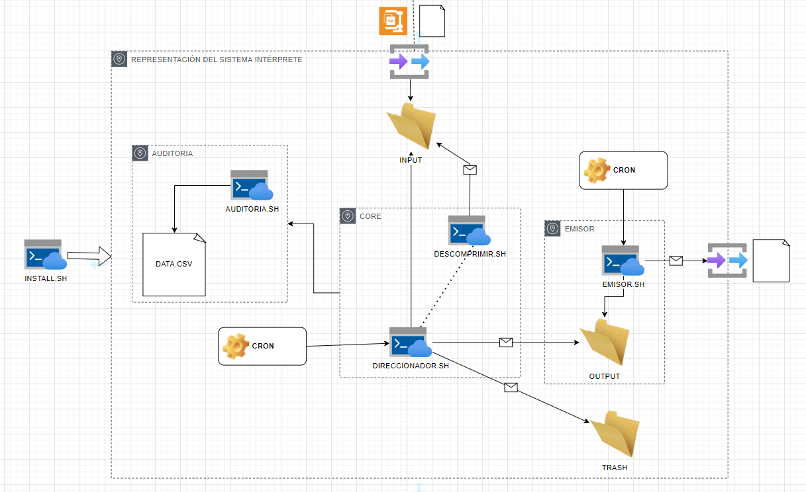

Nombre del problema:

Implementación de un Shell Script

Curso:

Sistemas Operativos

Tema de la sesión:

Automatización de Tareas

Logro de aprendizaje de la sesión:

Al finalizar la sesión el alumno implementa un script en Linux que soluciona una limitación del sistema utilizando las principales estructuras del Korn Shell enseñadas en clase.

Objetivo(s) del problema:

-       Aplicar los conocimientos adquiridos sobre el Korn Shell de Linux.

-       Formular alternativas de solución a un problema de la vida real, en el que un sistema tiene ciertas limitaciones para realizar una determinada tarea.

-       Sustentar la eficiencia del Shell Script creado y proponer futuros usos del mismo a problemas similares en un ambiente real.

Momento de la sesión en donde se desarrollará la actividad ABP.

PROBLEMA

Trabajas en una empresa de telecomunicaciones que tiene entre sus principales sistemas un sistema de mediación capaz de colectar archivos de las centrales de conmutación fija, móviles, plataforma de datos, etc. en su formato nativo, una vez colectado el archivo, de inmediato procede a procesarlo, registro por registro: lo parsea, reconoce, analiza, filtra, enriquece y genera información que otros sistemas de la empresa necesitan como entrada para sus procesos, tales como los sistemas de facturación, antifraude, liquidaciones, Roaming, datawarehouse, roamex, entre otros. Recientemente la empresa ha adquirido una plataforma de datos que genera información de las sesiones de datos que hacen los clientes en su formato nativo (ASN.1) pero que de inmediato procede a comprimir el archivo, haciéndole primero un zip y luego un tar, para luego dejarlo en un determinado directorio de su propio servidor, para que el sistema de mediación lo colecte. Dado que el sistema de mediación no puede procesar archivos comprimidos, el gerente de sistemas ha acudido a Ud. para encontrar una solución al problema, como arquitecto técnico Ud. lidera a un equipo de ingenieros que conocen de los sistemas de mediación a nivel mundial y tienen una semana para proponer, desarrollar, probar e implementar una solución al problema. Al diseñar su solución deben de considerar lo sgte.:

     ●        La plataforma de datos adquirida genera miles de archivos por día

     ●        Los archivos tienen un determinado patrón de nombre de archivo

     ●        El sistema de mediación es un sistema de misión critica que trabaja 24 x 7

     ●        El sistema de mediación procesa actualmente 2,500 millones de registros al día

     ●        El trabajo de colecta, procesamiento y distribución debe hacerlo el sistema de mediación

     ●        Ud., no puede modificar el sistema de mediación por temas de propiedad intelectual.

     ●        La solución debe ser simple pero robusta y muy eficiente

     ●        La solución no debe impactar a la performance del sistema en lo más mínimo

     ●        La solución no debe impactar a los desarrollos actualmente implementados

     ●        La solución debe de ejecutarse 24 x 7

     ●        La solución debe permitir ser ejecutada en background como interactivamente

     ●        La solución debe ser auditable

